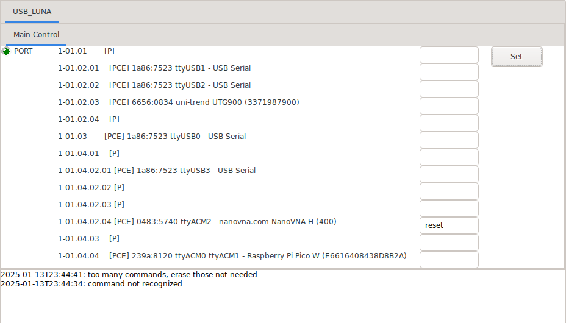

## Usbwatch.

A tool to soft reset, hard reset, cycle power, and disable individual
USB devices.

### Introduction.

One of the biggest issue with USB especially when
remotely controlling devices, such as with remote astronomy, is
that USB devices can hang and become inoperable.
A driver soft reset of the device might right it
but sometimes the fix requires someone to physically
cycle power on the device, or even 
reboot the host computer.  This tool is an attempt to provide addition options 
to help assist with this problem.  It provides not only a way to soft reset a
USB device, but it can also tell the device's hub to hard reset it, disable it,
or power it on and off (with power actually removed from the device if the hub supports
individual switching).

The tool works on linux and must be invoked as root [[2]](#2).

### Six Commands Provided.

The tool provides six commands to control a USB device: 1) soft reset, or a driver reset, 2) hard reset, or a reset performed by the hub, 3) disable, 4) power up, 5) power down, and 6) off to physically disconnect power from the device.
Each command requires the USB port location of the device to control.  The location is in the format of 1-00.00.00....
The first number is the bus number.  The next numbers are the port numbers of the hubs the device is
daisy chained off of.  The last number is the port number of the USB device itself.  If a command
is not provided then the tool will just list all devices connect to the computer.


### Three Modes of Operation.

The tool provides three modes of operation.  It can be invoked 1) on the command line, 2) as a REST server, or 3) as a INDI astronomical remote control
server.  For example to list USB devices using REST I ran:

```
$ curl http://luna.local:8080/
1-01.01       [P]    
1-01.02.01    [PCE] 1a86:7523 ttyUSB1 - USB Serial
1-01.02.02    [PCE] 1a86:7523 ttyUSB2 - USB Serial
1-01.02.03    [PCE] 6656:0834 uni-trend UTG900 (3371987900)
1-01.02.04    [P]    
1-01.03       [PCE] 1a86:7523 ttyUSB0 - USB Serial
1-01.04.01    [P]    
1-01.04.02.01 [PCE] 1a86:7523 ttyUSB3 - USB Serial
1-01.04.02.02 [P]    
1-01.04.02.03 [P]    
1-01.04.02.04 [PCE] 0483:5740 ttyACM2 - nanovna.com NanoVNA-H (400)
1-01.04.03    [P]    
1-01.04.04    [PCE] 239a:8120 ttyACM0 ttyACM1 - Raspberry Pi Pico W (E6616408438D8B2A)
```

The flags inside the brackets mean the following:

```
P    USB Port has power
E    USB Port is enabled
C    USB Port is connected
S    USB Port is suspended
R    USB Port is resetting
```

To soft reset the NanoVNA-H device via the command line I can use:

```
$ sudo $(which python) usbwatch.py --reset 1-01.04.02.04 
```

Or using the REST server above, I can also reset it with curl:

```
$ curl -d 1-01.04.02.04 http://luna.local:8080/reset
```

### The REST server.

The REST server is invoked using the --rest option.

```
$ sudo $(which python) usbwatch.py --rest
```

The server provides the following API:

```
GET  /        # list USB devices
POST /        # list USB devices 
POST /reset   # soft reset the posted device
POST /hard    # tell the hub to reset the posted device
POST /disable # tell the hub to disable the posted device
POST /up      # tell the hub to power on the posted device
POST /down    # tell the hub to power down the posted device
POST /off     # tell the kernel to power off the posted device
```

### The INDI server.

The INDI server is invoked using the --indi option.

Since the tool must
be invoked as root it runs as a separate INDI server.  It cannot be run by
regular indiserver.
However, indiserver can still connect to it using its @host:port relay syntax.

```
[luna] $ sudo $(which python) usbwatch.py --indi
[local]$ indiserver @luna.local [your other devices]...
```

The INDI device USBWATCH_{hostname}, where hostname is the host the tool is 
running on, should now show up on your INDI client.
The INDI device provides the following commands:
"reset", "hard", "disable", "up", "down", and "off".   Enter one of these commands into the 
appropriate field of the USB device to command.  Only one field can be set
at a time.  You might have to erase a previously written command.  If no command is given
then the port listing will be refreshed.

### Installation.

The tool runs using python.  It requires the libraries pyusb and pyserial.  These
can be installed using pip with the requirements.txt file provided:

```
pip install -r requirements.txt
```

### Usage

```
usage: usbwatch [-h] [--reset LOCATION] [--hard LOCATION] [--disable LOCATION]
                [--up LOCATION] [--down LOCATION] [--off LOCATION] [-v]
                [--rest] [--indi] [--host HOST] [--rest-port PORT]
                [--indi-port PORT]

Tool to soft reset, hard reset, power on and off, or disable USB ports.

options:
  -h, --help          show this help message and exit
  --reset LOCATION    tell driver to soft reset port (default: None)
  --hard LOCATION     tell USB hub to hard reset port (default: None)
  --disable LOCATION  tell USB hub to disable port (default: None)
  --up LOCATION       tell USB hub to power on port (default: None)
  --down LOCATION     tell USB hub to power off port (default: None)
  --off LOCATION      tell kernel to power off port (default: None)
  -v, --verbose       enable verbose messages (default: False)

server:
  --rest              start REST server (default: False)
  --indi              start INDI server (default: False)
  --host HOST         server host (default: 0.0.0.0)
  --rest-port PORT    REST server port (default: 8080)
  --indi-port PORT    INDI server port (default: 7624)
```

### Notes.

1\. This tool was based off the work of hubpower.c, Vadim Mikhailov's uhubctl.c, and Alan Stern's usbreset.c.  Please see the following websites regarding individual power switching of usb ports by hubs,
- https://github.com/mvp/uhubctl and
- https://elinux.org/RPi_Powered_USB_Hubs#Problem_USB_Hubs.

<a name="2"></a> 
2\. If you do not want to run usbwatch.py as root, another option is to add the following to your "udev" rules, but you still need to be root to turn off the device.
```
$ cat /etc/udev/rules.d/dialout.rules
SUBSYSTEM=="usb", MODE="0666"
```
OR, assuming you are part of the dialout group, you can try this.  However it does not seem to work on a raspberry pi.
```
$ cat /etc/udev/rules.d/dialout.rules
SUBSYSTEM=="usb", MODE="0660", GROUP="dialout"
```
3\. I still recommend installing uhubctl.  It seems to work better at physically turning off ports than my code, even though I use the same call. It does additional work to ensure the port actually turns off.

